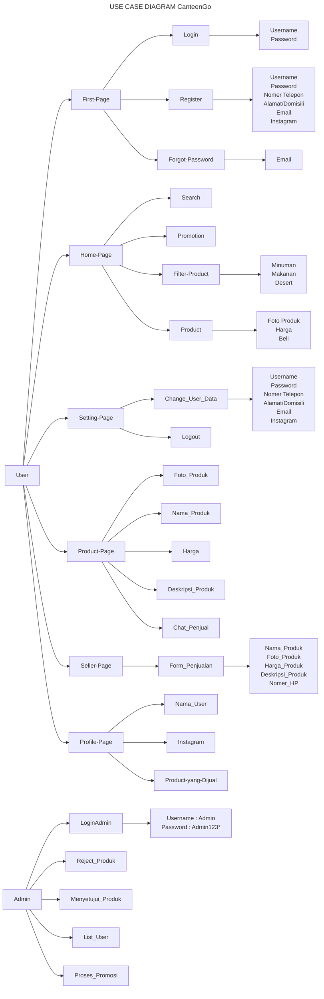
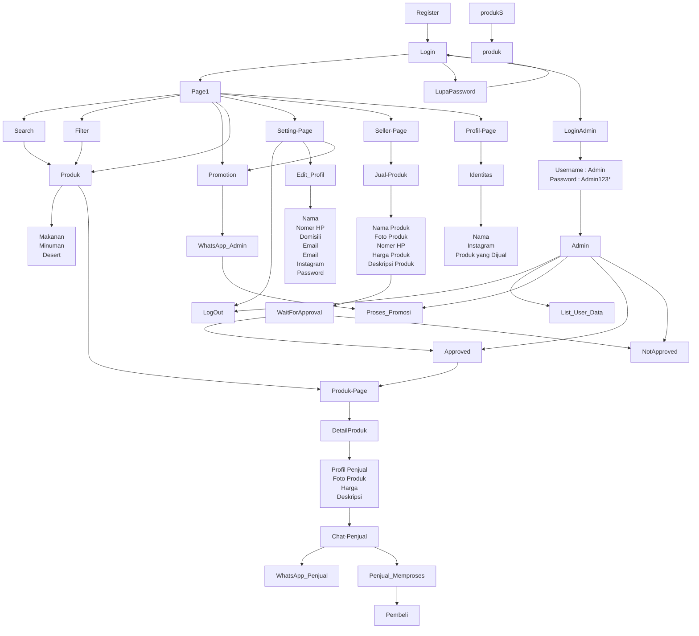

## CanteenGo

## Latar Belakang
Seiring dengan perkembangan teknologi saat ini, semakin mudah untuk kita dalam mengakses berbagai layanan secara digital. tetapi untuk saat ini, di kawasan universitas belum mengalami perubahan yang signifikan dalam bidang industri makanan dan minuman. Kantin-kantin atau pedagang di kampus atau universitas masih banyak yang hanya melayani secara langsung (offline). seiring berjalannya teknologi, kini para pedagang memiliki peluang untuk memanfaatkan teknologi yang bisa memperluas jangkauan dan memudahkan pemrosesan jual beli.

CanteenGO adalah sebuah aplikasi atau website kantin online yang dirancang untuk menjawab kebutuhan tersebut. Aplikasi ini memungkinkan para penjual untuk menjual produknya secara online yang bertujuan untuk meningkatkan jangkauan pembeli. Pada sisi pengguna, aplikasi ini memungkinkan pengguna untuk memesan makanan secara mudah dan memiliki banyak pilihan melalui perangkat mobile. CanteenGo hadir sebagai solusi bagi penjual tradisional yang ingin beralih ke sistem digital, sekaligus memberikan kemudahan bagi konsumen untuk mencari makanan yang diinginkan tanpa harus mengeluarkan tenaga ekstra.

# Visi dan Misi
## Visi
Menjadi platform untuk berjualan dengan konsep online agar menjangkau lebih banyak konsumen. dengan tujuan menghubungkan antara penjual dan pembeli melalui aplikasi atau website yang mudah digunakan.
## Misi
-Memberikan platform berjualan dengan mudah untuk para penjual.

-Memberikan akses mudah kepada para konsumen untuk mencari makanan den minuman dari para penjual melalui aplikasi tersebut.

-Menghubungkan antara penjual dan pembeli dengan mudah.

-Sebagai konsumen dapat meminimalisir pengeluaran tenaga ekstra untuk mencari makanan.

-Sebagai Penjual dapat menjual suatu produk dengan mudah dan efisien.

# Branding
Berikut ini adalah branding dari CanteenGo :
## Nama Produk : CanteenGo
CanteenGo diambil dari kata Canteen (Tempat Jual Beli) dan Go (Pergi). Filosfi dari kedua kata ini mencerminkan kemudahan untuk kegiatan jual beli.

## Tagline : sell it and buy it

## Campaign
Bagaimana membuat website yang penggunanya dapat melakukan jual beli secara mudah tanpa harus menggunakan banyak energi.

## Target User
- Penjual
- Pembeli

# Struktur Data

# Fungsi Sistem
## Login, Register dan Lupa Password
- Fungsi ini memudahkan user, baik user yang ingin membeli maupun user yang berjualan. hal tersebut berguna untuk mengetahui identitas dari penjual maupun pembeli.
- Pada fitur ini user dapat menginput data (Nama, Nomer HP, Domisili/Alamat, Email, Link Insagram, dam Password).
## Menjual Produk
- Fungsi ini beguna untuk user yang ingin berjualan di CanteenGo. user hanya butuh mengisi identitas dan produk apa yang ingin dijual, nantinya akan diproses langsung oleh admin (pengelola website)
## Admin
- Halaman admin berguna untuk mengontrol produk yang ingin diperjual belikan, apakah produk tersebut lulus pengujian atau tidak.
- Fitur pada page ini berisi {
  - Memproses promosi
  - Menyetujui Produk penjualan (ditambahkan ke home page/disetujui)
  - Reject produk penjualan
  - menghapus produk
  - mengubah produk
  - melihat list data user
  - logout
}
## Home Page
- Fitur pada page ini berisi {
- Fitur promosi
- Pencarian
- Filter (makanan, minuman, atau dessert)
- Produk yang dijual
  }

## Pemesanan
- Pemesanan dalam web ini terbilang mudah, web ini hanya menyediakan tempat atau lapak untuk menjual suatu produk. untuk sistem jual beli atau pemesanan, produk yang dijual sudah terhubung langsung dengan WhatsApp penjual, pembeli hanya perlu menekan tombol beli disalah satu laman produk, nantinya akan terhubung langsung dengan WhatsApp penjual.

## Profile Page
- Page ini berisi {
  - Setting(
  - Dapat merubah data user(Nama, Nomer HP, Domisili/alamat, Email, Instagram(Link), Password).
    )
  - Log out
  - Promosi ( Pada fitur ini penjual akan langsung di arahkan ke WA admin).
  }
## Halaaman Produk/ Pembelian
- Page ini berisi {
  - Profil Penjual
  - Nama Produk
  - Foto Produk
  - Harga Produk
  - Deskripsi Produk
  - Chat Penjual
}

## Menjual Barang
- Pada page ini user dapat menginput detail dari produk yang ingin dijual.
- page ini berisi {
  - Nama Produk
  - Foto Produk
  - Harga Produk
  - Deskripsi Produk
  - Nomer HP
  }

## Profil Penjual
-Pada page ini berisi {
  - Nama Penjual
  - Instagram Penjual
  - Produk yang dijual
}

# USE CASE DIAGRAM

## Activity Diagram

# User Story

Sebagai | Saya ingin bisa | Sehingga | Prioritas
---|---|---|---
Admin | Mengakses fitur admin | Dapat mengelola penuh website | ⭐⭐⭐⭐⭐
Pengguna | mengakses fitur atau menu dalam website | bisa menjalankan dam mengakses apa saja yang ada didalam beberapa fitur/menu tersebut | ⭐⭐⭐⭐⭐
Pengguna | Register | Bisa mendaftarkan akun dan biodata diri, agar dapat memasukan akun kedalam menu login | ⭐⭐⭐⭐⭐
Pengguna | Login | Bisa mengakses semua fitur yang tersedia pada website | ⭐⭐⭐⭐
Pengguna | Menjalankan beberapa fitur dan menggunakannya dengan baik  | sehingga | ⭐⭐⭐⭐
Pengguna | Mengakses menu utama | Membaca artikel atau beberapa cara yang disarankan agar memiliki pola hidup yang sehat | ⭐⭐⭐
Pengguna | Mengakses menu menabung | Pengguna dapat membuat daftar pemasukan dan pengeluaran harian agar tabungannya teratur dan terdata dengan baik | ⭐⭐⭐
Pengguna | Mengakses menu olahraga | Pengguna dapat melakukan olahraga harian secara teratur dan terstruktur | ⭐⭐⭐
Pengguna | Mengakses menu list harian | Pengguna dapat melakukan list harian atau mencatat kegiatan harian agar pengguna memiliki jadwal kegiatan yang terstruktur | ⭐⭐⭐
Pengguna | memasukan foto profil hingga data diri  | Pengguna dapat memasukan data diri dan foto profil sesuka hati pengguna | ⭐⭐
Pengguna | Mengubah foto profil hingga data diri | Pengguna dapat melakukan perubahan pada identitas diri dan foto profil tanpa adanya keterbatasan | ⭐⭐
Pengguna | Melihat menu saldo tabungan | Pengguna dapat mengetahui jumlah pemasukan dan pengeluaran| ⭐⭐
Pengguna | Memasuki halaman resep makanan | Pengguna dapat melihat beberapa menu mudah yang telah disarankan | ⭐
Pengguna | Log uot | Pengguna dapat mengeluarkan akun yang terkait didalam website | ⭐

# Arsitektur Sistem

#U I (Product Design)

